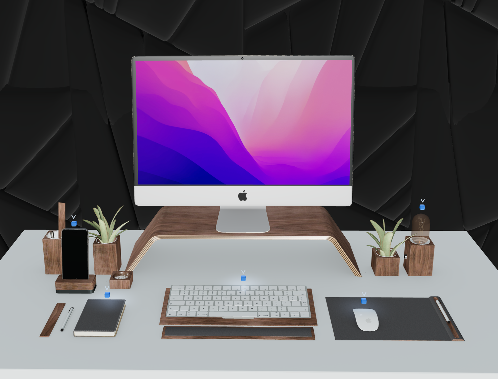

# 3D Portfolio Website

An interactive 3D portfolio website built with Next.js, TypeScript, and Three.js. This project showcases a 3D-rendered portfolio, highlighting projects, experience, and skills in a dynamic, engaging way.



## Table of Contents

- [Requirements](#requirements)
- [Installation](#installation)
- [Configuration](#configuration)
- [Usage](#Usage)
- [Features](#features)
- [Dependencies](#dependencies)

## Requirements

- Node.js: Ensure Node.js is installed (v14 or higher recommended).
- Next.js: Basic understanding of Next.js and React.
- Three.js: Basic understanding of Three.js for 3D rendering and animations.

# Installation

Clone the repository and install dependencies:

```bash
# Clone the repository
git clone https://github.com/your-username/3d-portfolio.git

# Navigate to the project directory
cd 3d-portfolio

# Install dependencies
yarn install
```

## Configuration

1. Environment Variables: If the project uses environment variables (for example, to handle sensitive data like API keys), create an `.env.local` file in the root directory and add any variables.

```bash
# .env.local
NEXT_PUBLIC_API_KEY=your_api_key_here
```

2. Three.js Setup: The project uses `@react-three/fiber` to handle Three.js rendering within React. Core settings for lighting, environment, and camera positioning are configured directly in the 3D scene components.

## Usage

To start the development server, use the following command:

```bash
# Run the development server
npm run dev
```

Access the project in the browser at `http://localhost:3000`. To build the project for production:

```bash
# Build for production
npm run build
```

And preview the production build locally:

```bash
# Preview the build
npm run start
```

## Features

- 3D Hero Animation: Engaging 3D animations on the hero section to captivate visitors.
- Dynamic Project Showcases: Interactive 3D models and hover effects for displaying project details.
- Responsive Design: Works seamlessly on desktop and mobile screens.
- Optimized Three.js: Leverages `@react-three/fiber` for smooth, performant 3D rendering and animations.
- Modular Components: Reusable components to enhance code readability and scalability.

## Dependencies

- Next.js: Core framework for server-side rendering and routing.
- Three.js: 3D rendering and animation.
- `@react-three/fiber`: React renderer for Three.js to make it easier to use within React components.
- `@react-three/drei`: Helper components for easier Three.js scene creation (e.g., camera controls, lighting).
- TypeScript: Ensures type safety and enhanced developer experience.

## License

MIT License. See `LICENSE` for more details.
